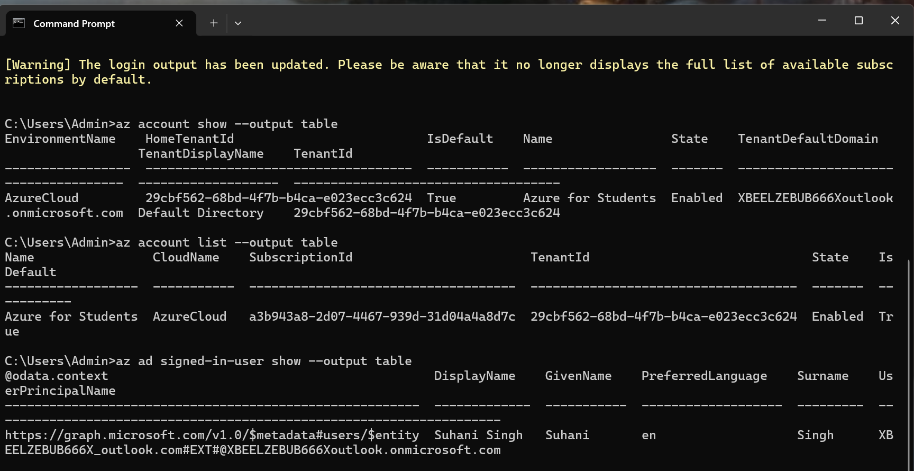
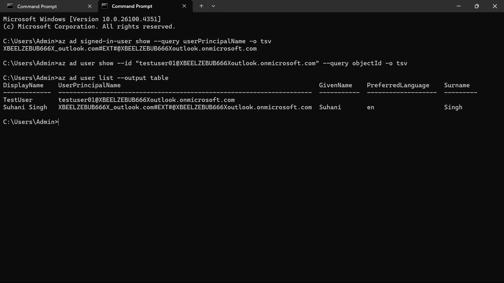
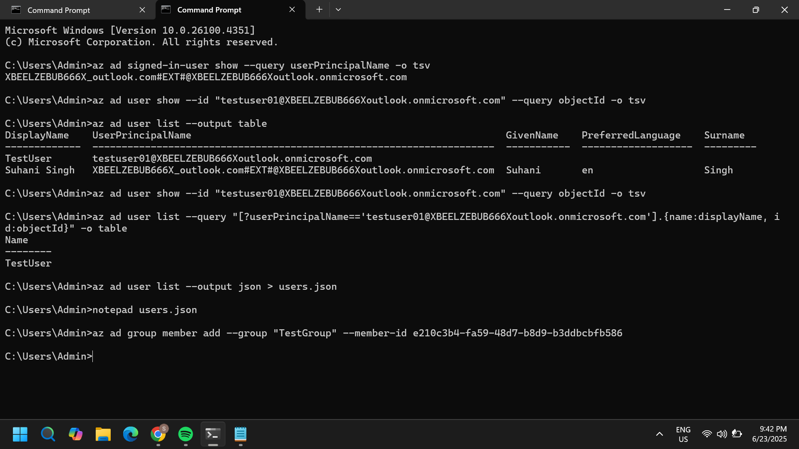
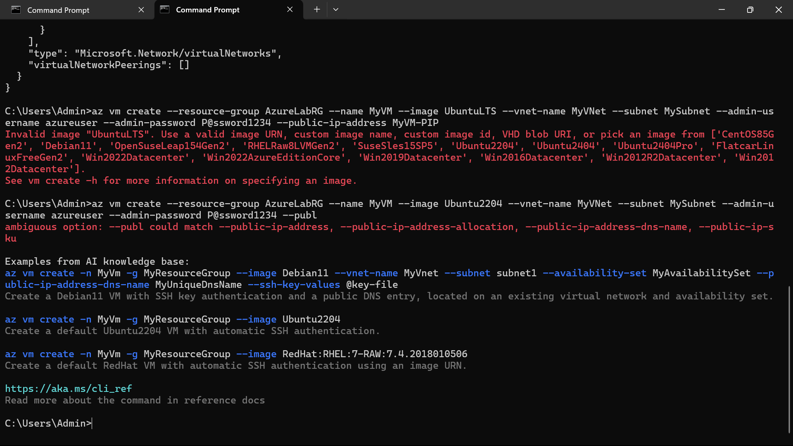

# 📘 Azure Lab Assignment – Full Documentation

This file documents all steps, commands, and screenshots used for the Azure lab assignment tasks.

---

## ✅ Task 1: Azure Identity, Roles & Access Control

### 🔹 Objective

* Observe Azure subscription and Entra ID
* Create test users and groups
* Assign built-in and custom RBAC roles

### 🔧 Steps

#### 1. View Subscription and User Info

```bash
az login
az account show --output table
az ad signed-in-user show --output table
```

📸 Screenshot: 

#### 2. Create User and Group

```bash
az ad user create --display-name "TestUser" --user-principal-name testuser01@XBEELZEBUB666Xoutlook.onmicrosoft.com --password "P@ssw0rd123!"
az ad group create --display-name "TestGroup" --mail-nickname "TestGroup"
az ad user list --output json > users.json
```

📸 Screenshot: 

#### 3. Get User Object ID and Add to Group

Extracted ID from JSON: `e210c3b4-fa59-48d7-b8d9-b3ddbcbfb586`

```bash
az ad group member add --group "TestGroup" --member-id e210c3b4-fa59-48d7-b8d9-b3ddbcbfb586
```

#### 4. Assign Built-in RBAC Role

```bash
az role assignment create --assignee testuser01@XBEELZEBUB666Xoutlook.onmicrosoft.com --role Reader --scope /subscriptions/<your-subscription-id>
```


#### 5. Create and Assign Custom Role

**customRole.json:**

```json
{
  "Name": "CustomReader",
  "IsCustom": true,
  "Description": "Read-only access to RGs",
  "Actions": [
    "Microsoft.Resources/subscriptions/resourceGroups/read"
  ],
  "AssignableScopes": [
    "/subscriptions/a3b943a8-2d07-4467-939d-31d04a4a8d7c"
  ]
}

```

```bash
az role definition create --role-definition customRole.json
az role assignment create --assignee testuser01@XBEELZEBUB666Xoutlook.onmicrosoft.com --role "CustomReader" --scope /subscriptions/<your-subscription-id>
```

📸 Screenshot: 

### ✅ Task 1 Complete

---

✅ Task 2: Azure CLI – VM, VNet, Policy, Key Vault, Backup, Alerts

🔹 1. Create Virtual Machine and Virtual Network via CLI
```bash
az network vnet create --resource-group AzureLabRG --name MyVNet --subnet-name MySubnet

az vm create --resource-group AzureLabRG --name MyVM --image Ubuntu2204 --vnet-name MyVNet --subnet MySubnet --admin-username azureuser --admin-password P@ssword1234 --publ
```
📸 Screenshot: 

🔹 2. Assign a Policy at Subscription Level
```bash
az policy definition list --query "[?displayName=='Audit virtual machines without disaster recovery configured'].id" -o tsv
```

🔹 3. Key Vault: Create, Store & Retrieve Secret via CLI
```bash
az keyvault create --name MyKeyVault --resource-group AzureLabRG --location eastus

az keyvault secret set --vault-name MyKeyVault --name MySecret --value "SuperSecret123"

az keyvault secret show --vault-name MyKeyVault --name MySecret
```

🔹 4. Schedule Daily VM Backup at 3AM using Vault
```bash
az backup vault create --resource-group AzureLabRG --name MyRecoveryVault --location eastus

az backup protection enable-for-vm --vault-name MyRecoveryVault --resource-group AzureLabRG --vm MyVM --policy-name DefaultPolicy
```

🔹 5. Create Alert Rule for CPU > 80%
```bash
az monitor metrics alert create --name HighCPUAlert --resource-group AzureLabRG --scopes /subscriptions/a3b943a8-2d07-4467-939d-31d04a4a8d7c/resourceGroups/AzureLabRG/providers/Microsoft.Compute/virtualMachines/MyVM --condition "avg Percentage CPU > 80" --description "CPU usage alert over 80%" --window-size 5m --evaluation-frequency 1m --action-group ""
```

✅ Task 2 Complete

---

